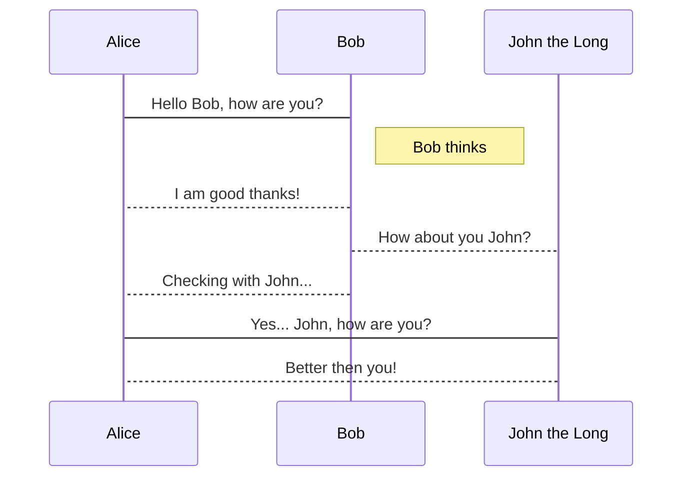

# md2key

Convert your markdown to keynote.

## Installation

```bash
gem install md2key
```

## Usage

- 1. Create a keynote document
- 2. Create a first slide as a cover slide
- 3. Create a second slide to choose a slide layout
- 4. Then execute `md2key markdown.md`


### Basic example

The slides in the movie can be generated with following markdown.  
You can separate slides with `---` just for readability.

```markdown
# The presentation
@k0kubun

## Hello world
- I'm takashi kokubun
- This is a pen

## How are you?
- I'm fine thank you
```

### Insert image

```markdown
# image slide

- This is an example
- You can insert an image


```

### Insert source code

If you have `highlight` command, you can insert syntax-highlighted source code.  
If you don't have it, execute `brew install highlight`.


<!-- <pre>
# ActiveRecord::Precount

```rb
Tweet.all.precount(:favorites).each do |tweet|
  p tweet.favorites.count
end
# SELECT `tweets`.* FROM `tweets`
# SELECT COUNT(`favorites`.`tweet_id`), `favorites`.`tweet_id` FROM `favorites` ...
```
</pre> -->

### Insert table
```markdown
## table

| a | b | c |
|:--|:--|:--|
| 1 | 2 | 3 |
```


### Insert flowchart & sequence diagram
```markdown
## flowchart & sequence diagram slide


```


### Insert presenter note

```markdown
# Keynote Speech

- OMG! I'm keynoting! :fearful:

^ Remember, what would Freddie Mercury do? Yes, I'm Freddie! We are the champions!!
```

## License

MIT License
